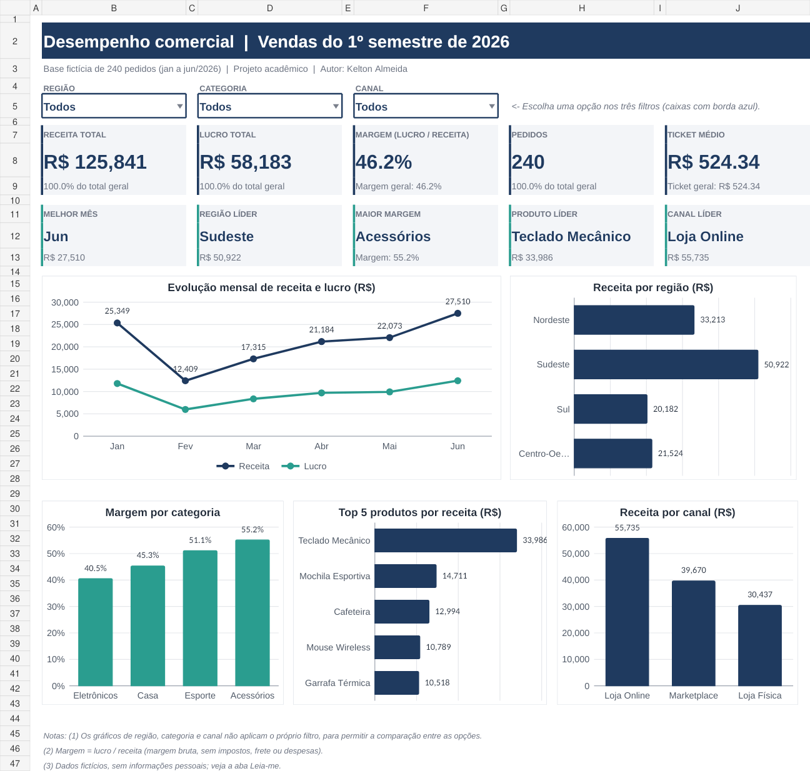

# 📊 Dashboard de Vendas 2026 — Excel

Projeto de análise de dados desenvolvido em **Microsoft Excel** com o objetivo de acompanhar o desempenho comercial de uma empresa fictícia durante o **1º semestre de 2026**.

O projeto foi construído como parte do meu portfólio de **Análise de Dados**, com foco em organização de dados, construção de indicadores, criação de visualizações e desenvolvimento de um dashboard simples, funcional e profissional.

> **Observação:** todos os dados utilizados neste projeto são fictícios e foram criados exclusivamente para fins acadêmicos e de portfólio.

---

## 📷 Preview do Dashboard



---

## 🎯 Objetivo do projeto

O objetivo deste dashboard é transformar uma base de vendas em informações de fácil interpretação, permitindo responder perguntas como:

- Qual foi a receita total no período?
- Qual foi o lucro obtido?
- Qual é a margem de lucro?
- Quantos pedidos foram realizados?
- Qual é o ticket médio?
- Qual foi o mês com melhor desempenho?
- Qual região apresentou maior receita?
- Qual categoria possui maior margem?
- Qual produto gerou mais receita?
- Qual canal de vendas teve maior participação?
- Como os resultados mudam de acordo com os filtros aplicados?

---

## 📌 Principais indicadores

O dashboard apresenta os seguintes KPIs:

| Indicador | Resultado geral |
|---|---:|
| Receita Total | R$ 125.841,00 |
| Lucro Total | R$ 58.183,00 |
| Margem Bruta | 46,2% |
| Pedidos | 240 |
| Ticket Médio | R$ 524,34 |

Além dos KPIs principais, o dashboard destaca automaticamente:

- **Melhor mês:** Junho
- **Região líder em receita:** Sudeste
- **Categoria com maior margem:** Acessórios
- **Produto líder:** Teclado Mecânico
- **Canal líder:** Loja Online

Os resultados acima representam a visão geral da base, sem filtros específicos selecionados.

---

## 🔎 Filtros disponíveis

O dashboard permite realizar análises utilizando três filtros:

- **Região**
- **Categoria**
- **Canal de venda**

Ao alterar os filtros, os principais indicadores e gráficos são recalculados automaticamente.

Os gráficos comparativos de Região, Categoria e Canal mantêm todas as opções visíveis para facilitar a comparação entre os grupos.

---

## 📈 Visualizações

O projeto possui visualizações para facilitar a análise do desempenho comercial, incluindo:

- Evolução mensal das vendas;
- Receita por região;
- Comparação entre categorias;
- Desempenho por canal de venda;
- Análise de produtos;
- Indicadores executivos de receita, lucro, margem, pedidos e ticket médio.

---

## 🗂️ Estrutura do arquivo

O arquivo `Dashboard_Vendas_2026.xlsx` é dividido em quatro abas:

### `Dashboard`

Área principal do projeto, onde estão os KPIs, filtros, destaques e gráficos.

### `Leia-me`

Documentação interna do projeto, contendo informações sobre objetivo, dados, indicadores, utilização e limitações.

### `Base_Vendas`

Base utilizada nas análises, composta por **240 pedidos fictícios**, registrados entre **01/01/2026 e 30/06/2026**.

Cada linha representa um pedido contendo informações como:

- Número do pedido;
- Data;
- Região;
- Categoria;
- Produto;
- Código do vendedor;
- Canal;
- Quantidade;
- Preço unitário;
- Custo unitário;
- Receita;
- Custo total;
- Lucro;
- Número do mês.

### `Apoio`

Contém tabelas e cálculos auxiliares responsáveis por alimentar os indicadores e gráficos do dashboard.

Essa separação ajuda a manter a área visual organizada e a lógica dos cálculos estruturada.

---

## 🛠️ Ferramentas e recursos utilizados

O projeto foi desenvolvido utilizando recursos nativos do **Microsoft Excel**, incluindo:

- Fórmulas e funções;
- `SUMIFS`;
- `COUNTIFS`;
- `IF`;
- `IFERROR`;
- Cálculos de receita, custo, lucro e margem;
- Validação de dados;
- Listas suspensas;
- Gráficos;
- Formatação condicional;
- Indicadores de desempenho (KPIs);
- Organização de base de dados;
- Tabelas auxiliares para cálculos dinâmicos.

---

## 🧮 Regras de negócio

Os principais indicadores foram calculados da seguinte forma:

**Receita**

`Quantidade × Preço Unitário`

**Custo Total**

`Quantidade × Custo Unitário`

**Lucro**

`Receita − Custo Total`

**Margem Bruta**

`Lucro ÷ Receita`

**Ticket Médio**

`Receita ÷ Quantidade de Pedidos`

---

## 🔐 Privacidade dos dados

A base foi criada exclusivamente para fins didáticos.

Não são utilizados dados reais de clientes, como:

- Nome;
- CPF;
- E-mail;
- Telefone;
- Endereço.

Os vendedores também são representados por códigos como `V01`, `V02` e `V03`, evitando a utilização de nomes pessoais.

---

## 🚀 Como utilizar

1. Faça o download do arquivo `Dashboard_Vendas_2026.xlsx`.
2. Abra o arquivo no Microsoft Excel.
3. Acesse a aba `Dashboard`.
4. Utilize os filtros de **Região**, **Categoria** e **Canal**.
5. Observe a atualização dos indicadores e gráficos.
6. Consulte a aba `Base_Vendas` para visualizar os dados utilizados na análise.
7. Acesse a aba `Leia-me` para consultar a documentação interna do projeto.

---

## 📚 Competências demonstradas

Este projeto demonstra conhecimentos iniciais importantes para uma posição de **Analista de Dados Júnior**, como:

- Limpeza e organização de dados;
- Estruturação de bases para análise;
- Construção de métricas e KPIs;
- Aplicação de regras de negócio;
- Uso de funções condicionais e agregações no Excel;
- Construção de dashboards;
- Visualização de dados;
- Identificação de padrões;
- Documentação de projetos;
- Comunicação de resultados de forma visual.

---

## ⚠️ Limitações

Este projeto utiliza uma base pequena e fictícia, contendo apenas seis meses de dados.

Por esse motivo:

- Os resultados não representam uma empresa real;
- Não devem ser utilizados para conclusões sobre sazonalidade;
- A margem apresentada é uma margem bruta simplificada;
- Impostos, frete, comissões, devoluções e despesas fixas não estão incluídos.

---

## 🔮 Possíveis melhorias futuras

Como evolução deste projeto, pretendo explorar:

- Power Query para automatizar o tratamento da base;
- Tabelas e gráficos dinâmicos;
- Segmentação de dados;
- Comparação entre realizado e meta;
- Análise de crescimento mensal;
- Novos indicadores comerciais;
- Versão do projeto em Power BI;
- Automação da atualização dos dados.

---

## 📁 Arquivos do repositório

```text
dashboard-vendas-excel/
│
├── Dashboard_Vendas_2026.xlsx
├── dashboard_preview.png
└── README.md
```

---

## 👨‍💻 Autor

**Kelton Almeida**

Projeto desenvolvido para fins de estudo, prática e construção de portfólio em **Análise de Dados**.

Se este projeto foi útil ou chamou sua atenção, fique à vontade para deixar uma ⭐ no repositório.
